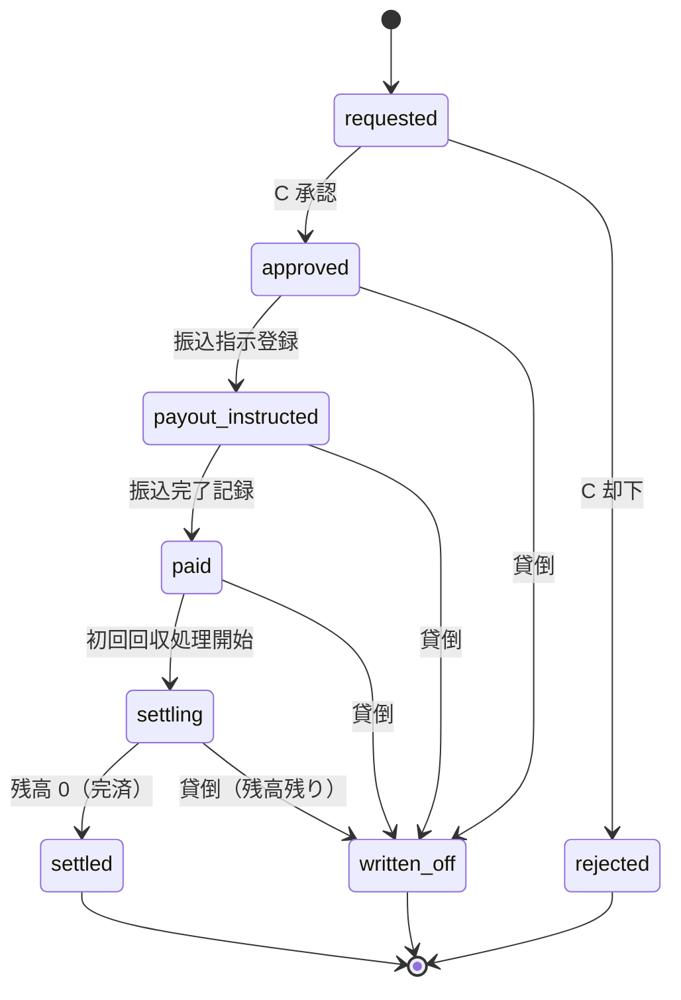

# advances 状態遷移図 (v2)

Assumptions:
- `paid` から `settling` への遷移は、初回の回収処理（給与バッチ）が行われた時点で行う。
- 貸倒 `written_off` は、回収途中または振込後にオペレーション判断で実行可能とする（負残防止のチェックは別途実装）。

```mermaid
stateDiagram-v2
    [*] --> requested
    requested --> approved: C 承認
    requested --> rejected: C 却下
    approved --> payout_instructed: 振込指示登録
    payout_instructed --> paid: 振込完了記録
    paid --> settling: 初回回収処理開始
    settling --> settled: 残高 0（完済）

    approved --> written_off: 貸倒
    payout_instructed --> written_off: 貸倒
    paid --> written_off: 貸倒
    settling --> written_off: 貸倒（残高残り）

    settled --> [*]
    rejected --> [*]
    written_off --> [*]
```

