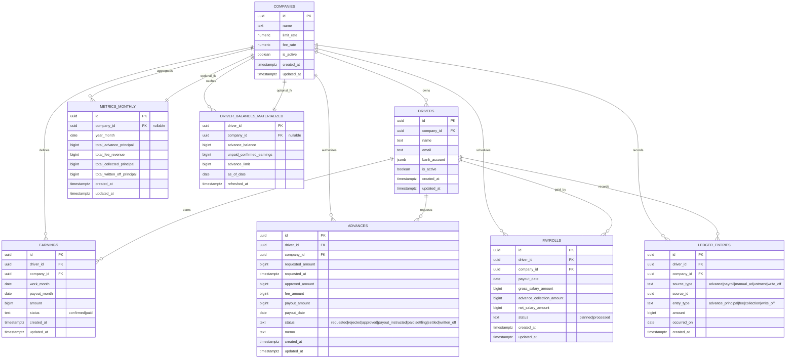

# ER 図 (v2 準拠)

```mermaid
erDiagram
    COMPANIES ||--o{ DRIVERS : owns
    COMPANIES ||--o{ EARNINGS : defines
    COMPANIES ||--o{ ADVANCES : authorizes
    COMPANIES ||--o{ PAYROLLS : schedules
    COMPANIES ||--o{ METRICS_MONTHLY : aggregates
    COMPANIES ||--o{ DRIVER_BALANCES_MATERIALIZED : caches
    COMPANIES ||--o{ LEDGER_ENTRIES : records

    DRIVERS ||--o{ EARNINGS : earns
    DRIVERS ||--o{ ADVANCES : requests
    DRIVERS ||--o{ PAYROLLS : paid_by
    DRIVERS ||--o{ LEDGER_ENTRIES : records

    METRICS_MONTHLY ||--|| COMPANIES : optional_fk
    DRIVER_BALANCES_MATERIALIZED ||--|| COMPANIES : optional_fk

    COMPANIES {
        uuid id PK
        text name
        numeric limit_rate
        numeric fee_rate
        boolean is_active
        timestamptz created_at
        timestamptz updated_at
    }

    DRIVERS {
        uuid id PK
        uuid company_id FK
        text name
        text email
        jsonb bank_account
        boolean is_active
        timestamptz created_at
        timestamptz updated_at
    }

    EARNINGS {
        uuid id PK
        uuid driver_id FK
        uuid company_id FK
        date work_month
        date payout_month
        bigint amount
        text status "confirmed|paid"
        timestamptz created_at
        timestamptz updated_at
    }

    ADVANCES {
        uuid id PK
        uuid driver_id FK
        uuid company_id FK
        bigint requested_amount
        timestamptz requested_at
        bigint approved_amount
        bigint fee_amount
        bigint payout_amount
        date payout_date
        text status "requested|rejected|approved|payout_instructed|paid|settling|settled|written_off"
        text memo
        timestamptz created_at
        timestamptz updated_at
    }

    PAYROLLS {
        uuid id PK
        uuid driver_id FK
        uuid company_id FK
        date payout_date
        bigint gross_salary_amount
        bigint advance_collection_amount
        bigint net_salary_amount
        text status "planned|processed"
        timestamptz created_at
        timestamptz updated_at
    }

    LEDGER_ENTRIES {
        uuid id PK
        uuid driver_id FK
        uuid company_id FK
        text source_type "advance|payroll|manual_adjustment|write_off"
        uuid source_id
        text entry_type "advance_principal|fee|collection|write_off"
        bigint amount
        date occurred_on
        timestamptz created_at
    }

    METRICS_MONTHLY {
        uuid id PK
        uuid company_id FK "nullable"
        date year_month
        bigint total_advance_principal
        bigint total_fee_revenue
        bigint total_collected_principal
        bigint total_written_off_principal
        timestamptz created_at
        timestamptz updated_at
    }

    DRIVER_BALANCES_MATERIALIZED {
        uuid driver_id PK
        uuid company_id FK "nullable"
        bigint advance_balance
        bigint unpaid_confirmed_earnings
        bigint advance_limit
        date as_of_date
        timestamptz refreshed_at
    }
```

