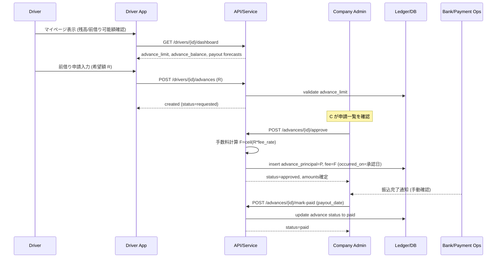

# シーケンス図: 前借り申請→承認→振込完了

Assumptions:
- 手数料計上および前借り元本の ledger 記録は「承認」時に行う。
- 振込完了は手動確認でステータス更新する（振込指示工程は設けない）。
- `settling` への遷移は給与回収バッチ時に行われ、本図では振込完了までを対象とする。

```mermaid
sequenceDiagram
    participant D as Driver
    participant App as Driver App
    participant API as API/Service
    participant C as Company Admin
    participant Ledger as Ledger/DB
    participant Bank as Bank/Payment Ops

    D->>App: マイページ表示 (残高/前借り可能額確認)
    App->>API: GET /drivers/{id}/dashboard
    API-->>App: advance_limit, advance_balance, payout forecasts

    D->>App: 前借り申請入力 (希望額 R)
    App->>API: POST /drivers/{id}/advances (R)
    API->>Ledger: validate advance_limit
    API-->>App: created (status=requested)

    Note over C: C が申請一覧を確認
    C->>API: POST /advances/{id}/approve
    API->>API: 手数料計算 F=ceil(R*fee_rate)
    API->>Ledger: insert advance_principal=P, fee=F (occurred_on=承認日)
    API-->>C: status=approved, amounts確定

    Bank-->>C: 振込完了通知 (手動確認)
    C->>API: POST /advances/{id}/mark-paid (payout_date)
    API->>Ledger: update advance status to paid
    API-->>C: status=paid
```
