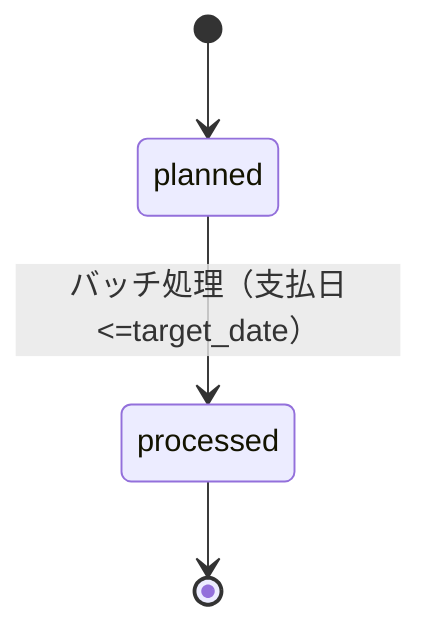

# payrolls 状態遷移図 (v2)

Assumptions:
- `planned` は C が登録した時点。日次バッチ `run_daily_batch(target_date)` で支払日到来分のみ `processed` に遷移する。
- 差し戻しは行わず、修正が必要な場合は新しい payroll レコードを追加する運用とする。

```mermaid
stateDiagram-v2
    [*] --> planned
    planned --> processed: バッチ処理（支払日<=target_date）
    processed --> [*]
```

