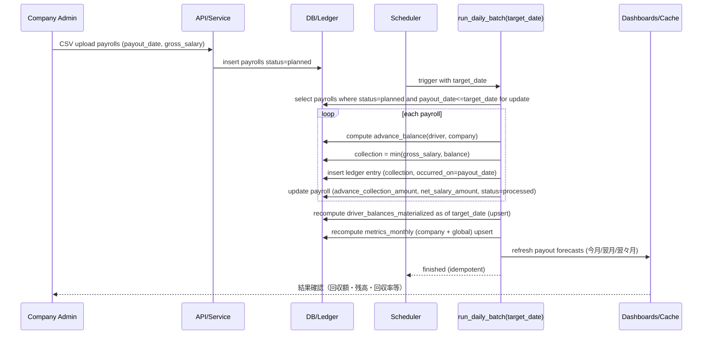

# シーケンス図: 支給日到来→日次バッチ→天引き→集計更新

Assumptions:
- target_date は Asia/Tokyo で解釈し、同日中にバッチを複数回実行しても冪等。
- 回収額計算は `C = min(gross_salary, advance_balance_at(target_date))`、手数料の追加計上はなし。
- driver_balances_materialized と metrics_monthly は毎バッチ再計算/upsert する。

